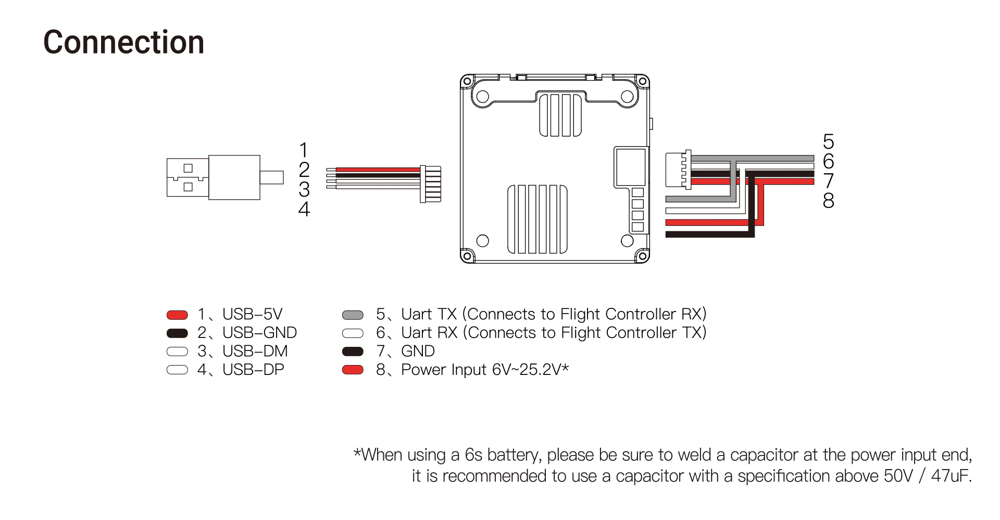
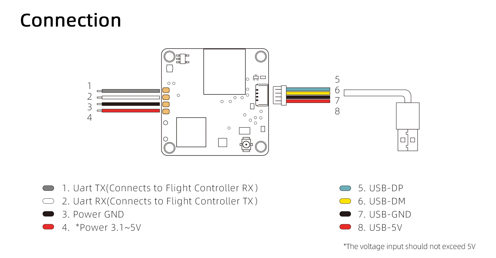
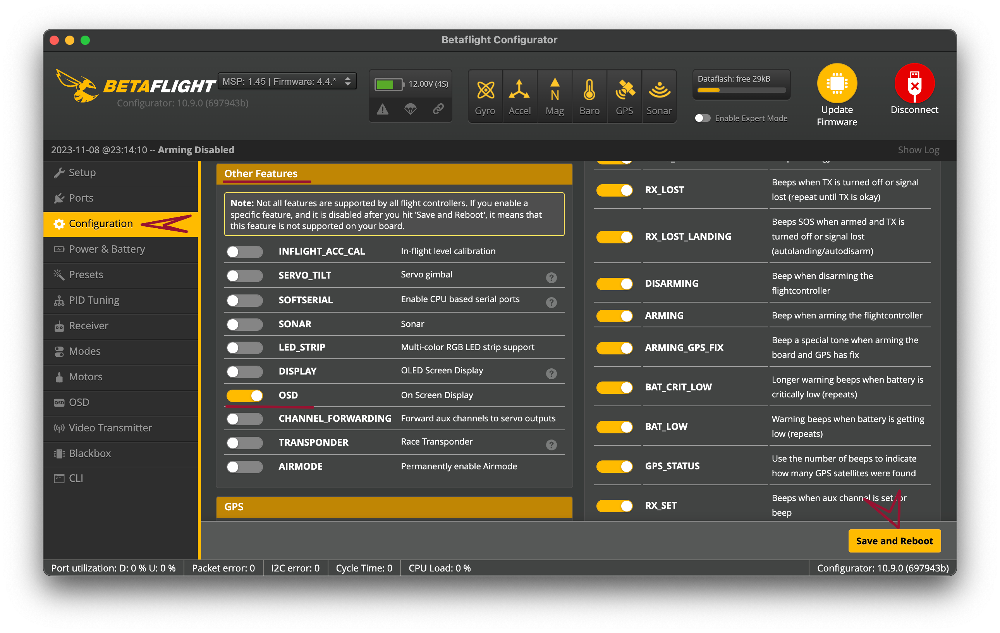
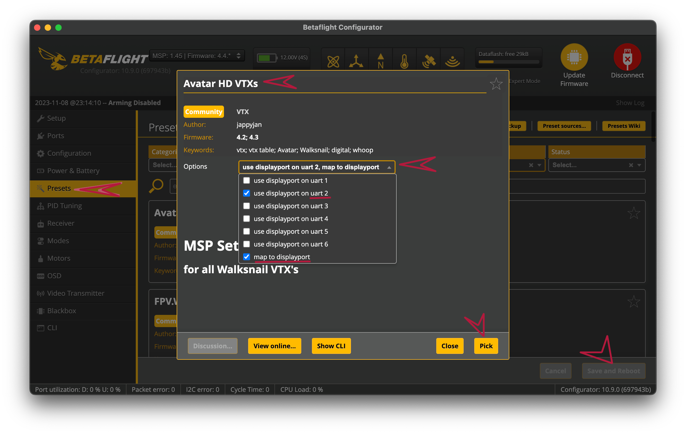

# Пайка, сборка, подключение

## База

На дрон устанавливается **unit** с подключенными к нему антенной(ами) и камерой. Unit (он же юнит) - это приемо-передающий модуль системы, который отправляет картинку с дрона и MSP телеметрию на очки или VRX. 

Вся электроника (очки/VRX, юнит, камера) должна быть из семейства Avatar (аватар), компоненты от других цифровых видеосистем, даже несмотря на идентичные разъемы, **не совместимы**, исключение составляет Fatshark Dominator HD/Recon HD (очки и шлем, совместимые с аватар системой).

Юнит также может называться **VTX** - VideoTX, под Tx в FPV обычно подразумевают передатчик (transmitter).

**VRX** расшифровывается как VideoRX, под RX в FPV обычно подразумевают приемник (receiver), но не стоит забывать, что цифровая связь - двунаправленная, потому передающий модуль есть в приемнике, и юнит не совсем корректно называть только передатчиком.

Обусловимся, что далее для простоты под очками будут подразумеваться очки, шлем, VRX.

Для взаимодействия юнита с очками необходимо произвести **bind** (он же бинд, биндинг) - процесс привязки. Эта процедура будет описана ниже. Бинд юнита работает только с одними очками, если забиндить юнит с другими очками, бинд с первыми очками будет потерян. Одни очки в свою очередь могут быть забинжены с огромным количеством юнитов.

Для того, чтобы другой человек мог наблюдать картинку, необходимо выводить изображение по проводу через hdmi out или использовать режим трансляции.

Так как система достаточно новая, многие функции появляются постепенно, и также постепенно исправляются имеющиеся проблемы. Для работы того или иного функционала должна быть нужная версия прошивки. Рекомендуется использовать последние стабильные версии прошивки. Прошивки ставятся как на юнит, так и на очки, версии могут отличаться, но в таком случае при каждом включении очком будет появляться предупреждение, что версии отличаются, и какая-то часть функционала может работать некорректно.

Поверх картинки с камеры в очках будет отображаться **OSD** (On Screen Display). Есть OSD очков по умолчанию, отображающие битрейт, качество связи, предупреждения.. а есть информация, получаемая из полетного контроллера, которую можно настроить в конфигураторе прошивки полетного контроллера. Об этом будет рассказано [здесь](https://avatarfpv.ru/building.html#настроика-osd).

## Что куда паять?

На юните есть 4 пина для подключения к дрону:

**Vin** (Voltage INput) - "плюс" для питания, диапазон напряжения зависит от конкретного юнита (ЧИТАЙТЕ ОПИСАНИЕ ВАШЕГО ЮНИТА).
Vin подключается к:
* выходу **BEC** (он же bec, бек/бэк, стабилизатор напряжения, понижающий модуль), если на борту есть такой с подходящим для вашего юнита напряжением и током;
* или к источнику питания (батарее, а точнее к имеющимся на вашей электронике пинам линии с напряжением аккумулятора), **ЕСЛИ** ваш юнит может принимать данное напряжение по спецификации, **И** на входе (у "корня" питающих проводов, к которым подключается аккумулятор) стоит LOW ESR конденсатор с рекомендуемыми параметрами (исключением может быть 1S tiny whoop).

> В случае, если вы подадите на юнит напряжение больше, чем указано по спецификации, юнит сгорит. Если bec, от которого вы запитали, не расчитан на такую нагрузку (как правило, в описании бека указан максимальный ток), либо юнит не заведется, либо будет перезагружаться, либо бек сгорит.

**GND** (GrouND) - "минус" для питания, подключается к GND пину на вашей бортовой электронике.

**TX** - пин для передачи данных, подключается на RX полетного контроллера; Rx на полетнике может быть подписан как R1, R2.., Rx1, Rx2..;

**RX** - пин для приема данных, подключается на TX полетного контроллера; Tx может быть подписан по аналогии с Rx, и стоит учесть, что Tx и Rx должны принаджежать одному и тому же UART (юарту, они же порты) полетника, т.е. должна быть одна и та же цифра в названии пинов, ИНАЧЕ не будет работать OSD.

В зависимости от юнита **порядок проводов будет отличаться, не перепутайте пины**, чтобы не спалить юнит! Обрати внимание на такую схему в описании приобретенного юнита:

*Описание подключения [VTX Avatar V2 Pro Module](https://caddxfpv.com/collections/walksnail-avatar-system/products/walksnail-avatar-hd-pro-kit-dual-antenna?variant=46963284246830), пины 5-8*

*Описание подключения [Mini VTX V3](https://caddxfpv.com/collections/walksnail-avatar-system/products/walksnail-avatar-hd-mini-1s-lite-kit?variant=44159424528686), как видно, порядок пинов для подключения к ПК другой, как и допустимое напряжение на входе, пины 1-4*

## Спаял, что делать дальше?

Вы спаяли - не спешите собирать "корпус" дрона, если у вас нет легкого доступа к кнопке бинда и разъему для USB шнурка.
Следующим шагом является прошивка. Можно было бы все настроить, забиндить, проверить, что работает, а потом при желании прошить, **НО** если вы обновите прошивку, бинд будет потерян, и придется биндить снова. Потому перейдите на страницу [Прошивка](https://avatarfpv.ru/firmware.html) и выполните необходимые шаги, после чего переходите к [следующему пункту](https://avatarfpv.ru/building.html#Binding).

## Binding

Для бинда необходимо:
* запитать дрон, очки, дождаться полной загрузки системы;
* нажать кнопку бинда на очках, когда очки начнут пищать;
* нажать кнопку на юните.
Очки перестанут пищать, на юните загорится зеленый диод на постоянку, в очках появится картинка с камеры - оборудование забинжено. 
Бинд выполняется один раз, после перезагрузки остается. Только после обновления прошивки придется заново выполнить процедуру бинда.

## Настройка OSD

### Betaflight

Рекомендуется использовать актуальную версию betaflight (4.4+ версия прошивки, 10.9+ версия конфигуратора).

#### Для betaflight 4.2, 4.3 

Выполните следующие шаги:
* вставьте usb провод в полетный контроллер и подключите к компьютеру;
* запустите betaflight configurator, нажмите *Connect (Подключиться)* ([не удалось подключиться, что делать?](https://avatarfpv.ru/building.html#решение-возникших-проблем));
* проверьте, что на вкладке *Configuration (Конфигурация)* в *Other features (Прочий функционал)* включено OSD;

* в разделе *Presets (Предустановки)* найдите пресет *Avatar HD VTXs*, нажмите на него;
* в *Options (Опции)* выберите тот юарт полетного контроллера, к которому припаяли Tx и Rx юнита (например, для Tx2, Rx2 нужно выбрать *use displayport on uart2*) и *map to displayport*;

* нажмите *Pick (Выбрать)* и после этого *Save and Reboot (Сохранить и перезагрузить)*;
* перейдите на вкладку *OSD*, выберите из списка слева любые желаемые элементы и расставьте их по полю в желаемом расположении;
* нажмите *Save* (Сохранить);
* включите очки, юнит, дождитесь загрузки системы, и убедитесь, что OSD отображается.

#### Для betaflight 4.4, 4.5

Если вы начинаете с прошивки полетного контроллера, убедитесь, что выставлен флаг OSD (HD). Если вы припаяли питание юнита к выходу ПК, на котором есть VTX Switch/RealPit (возможность включать/выключать питание по тумблеру), также не забудьте флаг PINIO.

Далее выполните шаги:
* вставьте usb провод в полетный контроллер и подключите к компьютеру;
* запустите betaflight configurator, нажмите *Connect (Подключиться)* ([не удалось подключиться, что делать?](https://avatarfpv.ru/building.html#решение-возникших-проблем));
* проверьте, что на вкладке *Configuration (Конфигурация)* в *Other features (Прочий функционал)* включено OSD;

* в разделе *Presets (Предустановки)* найдите пресет *OSD for Fpv.wtf, Dji O3, Avatar HD*;
* в *Options (Опции)* выберите *map to displayport*, *set HDOSD* и тот юарт полетного контроллера, к которому припаяли Tx и Rx юнита (например, для Tx2, Rx2 нужно выбрать *use displayport and MSP VTX on uart**2***);

* нажмите *Pick (Выбрать)* и после этого *Save and Reboot (Сохранить и перезагрузить)*;
* перейдите на вкладку *OSD*, в поле *Video format (Формат видео)* выберите *PAL/NTSC*, а потом *HD*, чтобы отобразилось поле корректного размера;

* выберите из списка слева любые желаемые элементы и расставьте их по полю в желаемом расположении;
* нажмите *Save (Сохранить)*;
* включите очки, юнит, дождитесь загрузки системы, и убедитесь, что OSD отображается.

### INav
 *в процессе написания*

### Ardupilot
 *в процессе написания*

### Решение возникших проблем

Если вы подключаете полетный контроллер к конфигуратору, и в конфигураторе не отображается новый порт:
* убедитесь, что используемый провод имеет data линии (может передавать данные, а не только питать), например, подключив другое устройство или сменив кабель на явно подходящий;
* в случае в Windows 10/11 установлены драйвера (https://betaflight.com/docs/wiki/archive/Installing-Betaflight#windows-10), можно запустить [ImpulseRC Driver Fixer](https://impulserc.com/pages/downloads) ;
* в случае с Linux выполнены все шаги из [инструкции по установке](https://betaflight.com/docs/wiki/archive/Installing-Betaflight#platform-specific-linux);