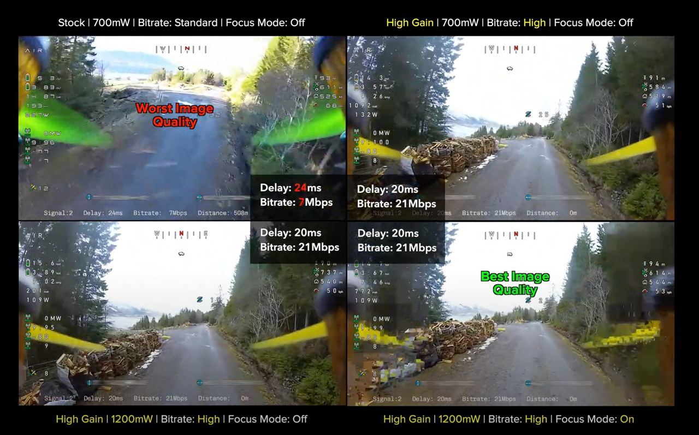

# Настройки для полетных контроллеров, камер, очков

## Рекомендуемые параметры камер: 

dnr : off всегда. Шумадав сильно шакалит картинку и шумы всюравно малоцветные - выше детализация при всех условиях. PS шумадав работает на очках в видео с двр юнита без него.
mode: night/day  для про камеры (ночь без фонарей  день с фонарями) , для обычной в сумерках всегда ставим night (лишние пару стопов света). днем day.
Saturation: 4 
WhiteBalance: всегда фиксированый ставим на глаз 4800 \ 5500 \ day \ cloud.  
Sharpness: 1
AspectRatio : на v2 v3 камере 4:3 на v1, nano light, pro - 16:9 (это нативные соотношения сторон для камер). 
для vrx и например sky04x ставим режим 4:3 full будет картинка растянутая на всю матрицу очков.

## Настройки в очках

Для полетов в одиночку:

## Шрифты

https://sites.google.com/view/sneaky-fpv/home

Накладывание OSD на видео - https://github.com/avsaase/walksnail-osd-tool